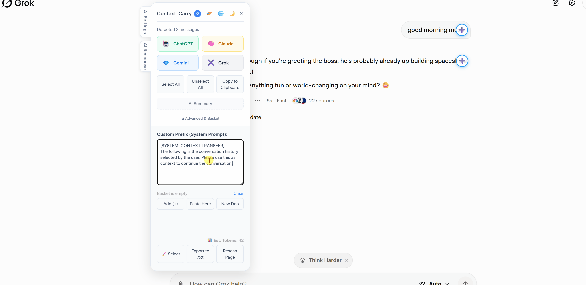
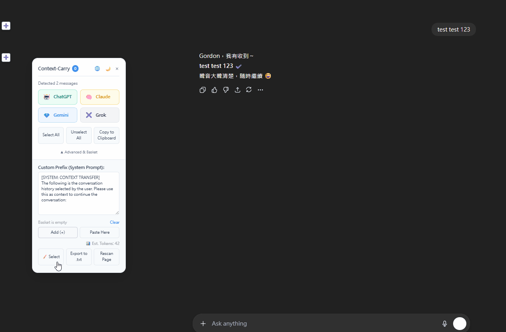

# Context-Carry  
### 瞬間在 ChatGPT、Claude、Gemini 與 Grok 之間轉移您的對話語境。

[](https://chromewebstore.google.com/detail/okjnafabngnahdppmbnmefofokpegccm?utm_source=item-share-cb)
[](README.md)


**Context-Carry** 是一款輕量級的 Chrome 擴充功能，讓您可以擷取、清理並在不同的 AI 平台之間轉移文字——無需複製貼上，也不會出現格式錯亂的問題。

---

## 🚀 快速開始 (Quick Start)
1. 開啟任何網頁或 AI 聊天  
2. 透過 **➕ / 畫筆 / 拖放** 擷取內容  
3. 將內容存入 **語境籃（Context Basket）**  
4. 直接拖到任何地方，或自動填入另一個 AI 對話

---

## ✨ 功能特色
- 從 **任何網頁或 AI 對話** 擷取文字
- 視覺化 **區域選取（畫筆模式）**
- 使用 **語境籃（Context Basket）** 暫存與重排片段
- 支援 **網頁 → 語境籃 → 任意輸入欄位** 的拖放流程
- 匯入本地端 `.txt` / `.md` 檔案
- 乾淨的 Markdown 輸出與 Token 估算
- 一鍵轉移至 **ChatGPT / Claude / Gemini / Grok**
- 選用 **本地 AI（Ollama）** 與 **xAI（Grok）API** 支援

---

## 🎥 功能演示






---

## 🔧 安裝方式
### Chrome 應用商店
即將上架
<!-- [前往 Chrome Web Store 安裝](https://chromewebstore.google.com/detail/okjnafabngnahdppmbnmefofokpegccm) -->

### 手動安裝 (開發者模式)
1. 下載此儲存庫 (Repo)
2. 在瀏覽器網址列輸入 `chrome://extensions/`
3. 開啟右上角的 **開發者模式 (Developer Mode)**
4. 點擊 **載入未封裝項目 (Load unpacked)** → 選擇資料夾

---

## ⌨️ 快捷鍵
| 快捷鍵 | 功能 |
|--------|--------|
| **Alt + M** | 開啟/關閉 面板 |
| **Alt + C** | 畫筆擷取模式 (Paintbrush) |
| **Alt + L** | 切換介面語言 |

---

## 🔐 隱私權
- 100% 本地端運算處理
- 不收集任何用戶數據
- 瀏覽器重啟時自動清除暫存的語境內容

詳細資訊請參閱 **[PRIVACY.md](PRIVACY.md)**。

---

## 🤝 參與貢獻
```bash
git clone https://github.com/gordonsay/Context-Carry.git
```

---

## 隱私與授權
[README (英文)](README.md) | [隱私](PRIVACY.md) | [授權](LICENSE)

---

## ❤️ 支持開發
如果這個擴充功能幫您節省了時間，歡迎請我喝杯咖啡！
<a href="https://www.buymeacoffee.com/gordonsay">
  
</a>