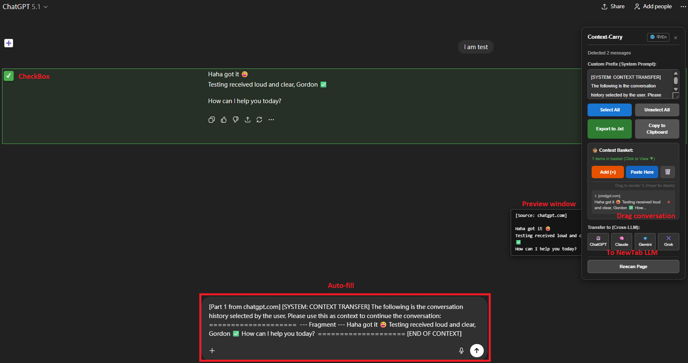
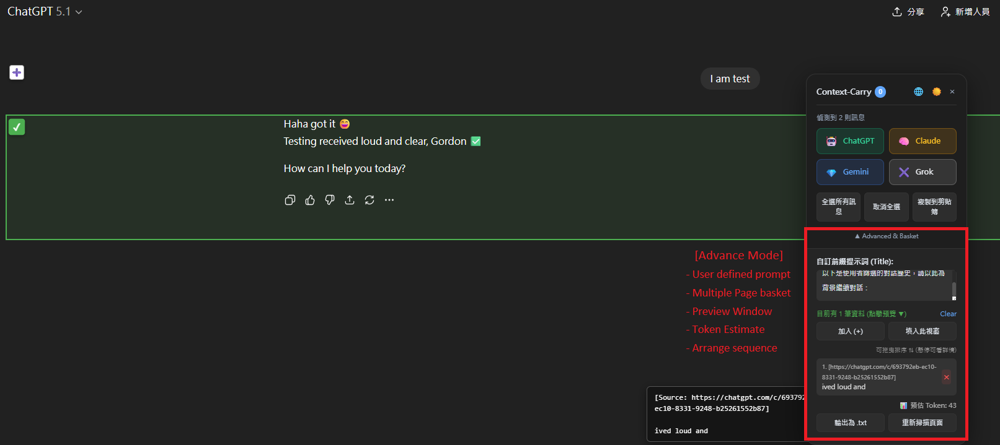

# Context-Carry — 一鍵在 ChatGPT、Claude、Grok、Gemini 之間轉移完整對話上下文

> [🔙 返回英文版本（English Version）](README.md)

[](README.md)


<details>
  <summary>目錄（點擊展開）</summary>

- [快速上手](#快速上手)
- [典型使用情境](#典型使用情境typical-use-cases)
- [核心功能](#核心功能key-features)
- [操作截圖](#操作截圖)
- [安裝方式](#安裝方式)
- [使用方式](#使用方式)
- [隱私說明](#隱私說明)
- [免責聲明](#免責聲明)
- [更新日誌](#更新日誌)
- [授權](#授權)

</details>

**停止重複撰寫相同提示詞，一鍵在不同 AI 平台之間轉移完整上下文。**

Context-Carry 是一款輕量、專為進階使用者打造的 Chrome 擴充功能，讓你可以：

- ✅ 從 ChatGPT、Claude、Gemini、Grok 擷取對話紀錄  
- ✅ 從任何網站擷取重要文字（文件、部落格、StackOverflow）  
- ✅ 重新排序並建構乾淨、具邏輯的上下文內容  
- ✅ 一鍵自動填入到新的 AI 對話視窗  
- ✅ 即時 Token 預估，避免超出上下文長度限制  

這款工具專為**開發者、研究人員與高頻 AI 使用者**設計，  
適合每天在多個 AI 平台之間切換、又討厭不斷重建 prompt 的你。

> 如果你每天都在使用多個 AI 工具，Context-Carry 每週能幫你節省數小時的重複操作時間。

---

## 快速上手

1. 開啟 **ChatGPT / Claude / Gemini**
2. 點擊右側的 **Context-Carry 懸浮面板**
3. 點擊 **➕** 擷取對話  
   （或使用 **Shift + 點擊** 進行多段選取）
4. 開啟另一個 AI 平台分頁
5. 點擊 **New Chat** → ✅ 自動填入完成

全程無需複製貼上、無需重新排版。

---

## 典型使用情境（Typical Use Cases）

- 🔁 將長篇 ChatGPT 討論一鍵轉移到 Claude 進行深度推理  
- 🧪 在不同 LLM 之間交叉比對 Debug 對話  
- 📚 收集 文件 + StackOverflow + Chat 討論 組成單一乾淨 Prompt  
- 🧠 重複使用結構良好的提示詞，而不是每次重貼  
- 📏 透過 Token 預估避免 Context Window 爆掉  

---

## 核心功能（Key Features）

- **畫筆圈選擷取（Area Select / 圈選區域）🖌️【New!】**
  啟動圈選模式後，可自由在任何網站畫出區域，系統會自動擷取該區域內的所有文字，並顯示即時預覽確認視窗。

- **跨網站通用擷取**
  不只支援 AI 聊天頁，在任何網站中選取文字，右鍵即可加入 Context Basket。

- **跨視窗 Context Basket**
  你可以同時從多個分頁（AI、文件、論壇、技術文章）收集片段，最後一次整理後轉移。

- **拖曳排序**
  可在 Basket 中自由拖曳調整順序，重組 AI 理解的敘事流程。

- **Token 智慧估算（Cross-Tab 同步）**
  Token 預估數量會在不同分頁即時同步更新，避免超出上下文長度限制。

- **System Prompt 乾淨分離（Clean Context）**
  System Prompt（前綴提示詞）與實際內容正式分離管理，加入 Basket 的內容不再混入重複的 system prompt，避免多來源合併時污染上下文。

- **智慧輸出排程（Smart Export Choice）**
  當 Basket 與頁面選取內容同時存在時，匯出時可選擇：
  - 僅輸出頁面
  - 僅輸出 Basket
  - 合併輸出（Append）

- **Magic Auto-Fill 自動填入**
  自動開啟目標 AI 網站並填入整理好的內容，完全免貼上。

- **Markdown 格式轉換**
  自動將 HTML 轉為乾淨 Markdown（標題、粗體、程式碼區塊）。

- **可拖曳懸浮介面**
  面板位置可自由拖移，不會遮擋畫面。

---

## 操作截圖






---

## 快捷鍵（Keyboard Shortcuts）

| 快捷鍵 | 功能 | 說明 |
|--------|------|------|
| **Alt + M** | 開關面板 | 快速顯示 / 隱藏 Context-Carry |
| **Alt + Z** | 啟動圈選 | 進入畫筆圈選模式 |
| **Alt + L** | 切換語言 | 中 / 英介面切換 |

---

## 安裝方式

### Chrome 線上應用程式商店
即將上架。

### 手動安裝（開發者模式）

1. 下載最新原始碼或 clone 本專案
2. 在 Chrome 開啟：`chrome://extensions/`
3. 開啟右上角「開發者模式」
4. 點擊「載入未封裝項目」
5. 選擇此擴充功能所在資料夾

---

## 使用方式

### 方法一：擷取 AI 對話

1. 開啟 ChatGPT / Claude / Gemini / Grok
2. 點擊 **Context-Carry 懸浮面板**
3. 點擊 **➕** 選取單則訊息  
   或使用 **Shift + 點擊** 進行區段選取
4. 點擊 **Add (+)** 加入 Basket

---

### 方法二：畫筆圈選模式（Area Select）

1. 點擊 Context-Carry 面板上的 **🖌️ 畫筆圖示**  
   或按下快捷鍵 **Alt + Z**
2. 在畫面上自由畫出要擷取的區域
3. 系統會顯示即時文字預覽視窗
4. 點擊「加入採集籃（Add to Basket）」即可儲存

---

### 方法三：從任何網站擷取文字

1. 在任意網站選取文字（文件、技術文章、新聞等）
2. **滑鼠右鍵**
3. 點擊 **「Add to Context Basket (+)」**
4. 擴充功能圖示會顯示目前項目數量

---

### 方法四：整理與轉移上下文

1. 點擊 Context-Carry 面板
2. 點擊 Basket 箭頭 **▼** → 可拖曳重新排序
3. 查看 **Est. Tokens（預估 Token）**
4. 選擇轉移方式：
   - ✅ **New Chat**：開新分頁並自動填入
   - ✅ **Existing Chat**：在目前視窗點擊 **Paste Here**

---

## 隱私說明

- 所有功能皆在本機執行
- 僅使用 `chrome.storage` 作為跨分頁暫存用途
- **不會蒐集、儲存、或傳送任何使用者資料到外部伺服器**
- 詳細請參考 [PRIVACY.md](PRIVACY.md)

---

## 開發說明

歡迎提交 Pull Request。  
若為重大改動，請先建立 Issue 討論。

  ```bash
    git clone https://github.com/gordonsay/Context-Carry.git
  ``` 

---

## 免責聲明

本擴充功能與 OpenAI、Anthropic、Google、xAI 無任何隸屬或合作關係。 所有產品名稱、商標與品牌皆屬於其各自擁有者。

## 更新日誌

請參閱 [CHANGELOG.md](CHANGELOG.md) 以獲取更新日誌。


## 授權

本專案採用 MIT 授權 - 詳細內容請參考 [LICENSE](LICENSE) 檔案。


## 連絡方式

如需任何幫助，請在 [GitHub repository](https://github.com/gordonsay/Context-Carry) 上建立 Issue。


## 注意事項

由於瀏覽器安全性限制，檔案附件（PDF/圖片）無法自動轉移。


## 關鍵字

ChatGPT Chrome 擴充功能、Claude 上下文工具、Gemini Prompt 轉移、LLM 上下文管理工具、Prompt 工程、AI 工作流程工具、跨 LLM 對話轉移
